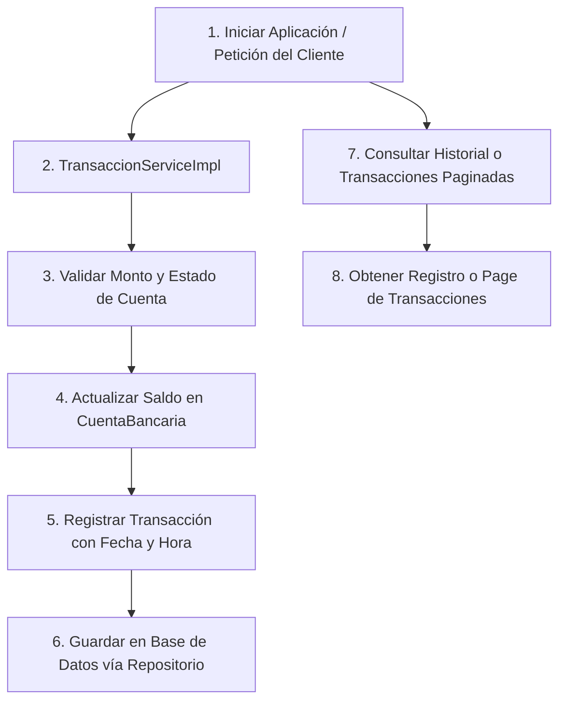

# Sistema de Gestión de Transacciones Bancarias

**Institución:** Universidad Nacional de Jujuy (UNJu)  
**Facultad:** Facultad de Ingeniería  
**Materia:** Desarrollo y Arquitecturas Avanzadas de Software. 

### Integrantes del Proyecto

* **Lucia Fernández Zapatero**
* **Valentina Orrabaliz**

---

## 1. Descripción del Proyecto

El presente proyecto consiste en el diseño e implementación de una API RESTful para la gestión de un sistema bancario. 
Entre sus funcionalidades principales, el módulo transaccional permite la ejecución de depósitos y extracciones actualizando el saldo de las cuentas de forma segura. En paralelo, el módulo de consultas y auditoría ofrece diferentes servicios para la trazabilidad de los movimientos:
* **Consulta individual:** Obtención detallada de una transacción específica a través de su identificador único (UUID).
* **Historial por cuenta:** Recuperación del listado completo de movimientos asociados a una cuenta bancaria ordenados cronológicamente.
* **Auditoría por rango de fechas:** Consulta filtrada de transacciones dentro de una ventana temporal específica (`inicio` y `fin`).
* **Paginación por tipo de transacción:** Listado optimizado de movimientos (depósitos o extracciones) utilizando paginación en base de datos.

---

## 2. Arquitectura del Repositorio y Capas

La estructura del código fuente está organizada bajo una arquitectura en capas, asegurando la separación clara de responsabilidades:

```text
ar.edu.unju.fi.arquitecturas.tp2banco
│
├── enums           # Definición de constantes del dominio (estados de cuenta, tipos de transacción y estados de procesamiento).
├── excepcion       # Clases de excepciones personalizadas para el control de reglas de negocio e inconsistencias.
├── modelo          # Entidades JPA que representan las tablas de la base de datos y su mapeo objeto-relacional.
├── repositorio     # Interfaces de Spring Data JPA encargadas del acceso, persistencia y consultas paginadas en la BD.
└── servicios       # Lógica de negocio del sistema, validaciones financieras y coordinación entre repositorios.
    └── impl        # Implementaciones concretas de las interfaces de servicio.
```

---

## 3. Flujo de Trabajo



---

## 4. Tecnologías Utilizadas

* **Lenguaje de Programación:** Java 25
* **Framework Principal:** Spring Boot 3.x
* **Acceso a Datos:** Spring Data JPA
* **Librerías de Soporte:** Lombok (`@Getter`, `@Setter`, `@SuperBuilder`)
* **Gestor de Dependencias:** Apache Maven

---

## 5. Decisiones de Diseño y Reglas de Negocio

1. **Precisión Monetaria:** Los montos se gestionan  mediante el tipo de dato `BigDecimal` para evitar imprecisiones financieras.
2. **Restricción en Entidades:** Se prescinde del uso de la anotación `@Data` en las entidades del modelo JPA, utilizando de forma explícita `@Getter` y `@Setter` para evitar comportamientos no deseados en métodos como `hashCode` y `equals`.
3. **Paginación de Consultas:** Las búsquedas de transacciones por tipo se implementan utilizando las interfaces `Pageable` y `Page<T>` de Spring Data, optimizando el rendimiento del servidor al fragmentar los resultados devueltos por la base de datos.

---